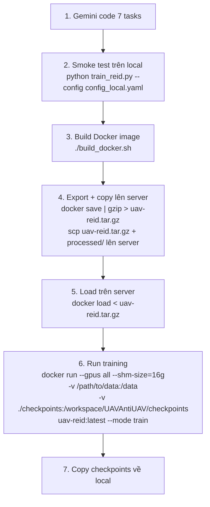

# Kế hoạch Deploy UAVAntiUAV — H100 Docker Offline (v2)

## Đã hoàn thành ✅

### 3 file config YAML thống nhất (data pipeline → train → eval)

| File | Mục đích | Batch | Epochs S1/S2 | AMP | Workers |
|---|---|---|---|---|---|
| [`config_jetson.yaml`](file:///home/namm/thang/UAVAntiUAV/config_jetson.yaml) | Train thật trên Jetson | 8 | 30 / 20 | ❌ | 2 |
| [`config_local.yaml`](file:///home/namm/thang/UAVAntiUAV/config_local.yaml) | **Smoke test** — chỉ chạy 1 epoch kiểm lỗi | 16 | **1 / 1** | ✅ | 4 |
| [`config_h100.yaml`](file:///home/namm/thang/UAVAntiUAV/config_h100.yaml) | Train production trên H100 (Docker) | 128 | 30 / 20 | ✅ | 8 |

### Cấu trúc YAML chung

```yaml
device:           # platform, gpu_jetson
paths:            # data_dir, gasnet_weights, checkpoint_dir, log_dir
data_pipeline:    # num_before/after_frames, bbox_padding, crop_size, num_workers
train:            # batch_size, num_instances, use_amp, stage1/stage2, loss
eval:             # model_path, pairs_json, batch_size, reid_threshold
```

> [!NOTE]
> Config `local` đặt epochs = 1 cho cả 2 stage. Gemini dùng config này khi cần test nhanh xem code có chạy đúng không.

---

## Các task cần code

### Task 1: Tạo `requirements.txt`

```
numpy>=1.24
Pillow>=10.0
opencv-python-headless>=4.8
tqdm>=4.60
PyYAML>=6.0
```

> [!IMPORTANT]
> Thêm `PyYAML` vì chuyển sang dùng YAML config. Không liệt kê `torch`/`torchvision` vì dùng base image PyTorch sẵn.

---

### Task 2: Sửa `model.py` — hỗ trợ env `GASNET_PATH`

Sửa đoạn [dòng 7–15](file:///home/namm/thang/UAVAntiUAV/model.py#L7-L15):

```python
# Ưu tiên: ENV > relative path > hardcode
gasnet_path = os.environ.get('GASNET_PATH',
    os.path.abspath(os.path.join(os.path.dirname(__file__), '../UAV/gasnet_project')))
if gasnet_path not in sys.path:
    sys.path.append(gasnet_path)
```

Xóa block `alt_gasnet_path` hardcode (dòng 13-15).

Sửa `UAVReIDNet.__init__` [dòng 229-232](file:///home/namm/thang/UAVAntiUAV/model.py#L229-L232):

```python
if gasnet_weights_path is None:
    gasnet_weights_path = os.environ.get('GASNET_WEIGHTS',
        os.path.abspath(os.path.join(os.path.dirname(__file__),
            '../UAV/gasnet_project/test/gasnet.best.pth')))
```

---

### Task 3: Sửa `train_reid.py` — đọc YAML config

Thay đổi cần làm:
1. `import yaml` thay cho `import json` (giữ json cho logging)
2. Đọc config bằng `yaml.safe_load()` 
3. Map các field YAML lồng nhau vào args:

```python
with open(args.config, 'r') as f:
    cfg = yaml.safe_load(f)

# Paths
args.data_dir       = cfg['paths']['data_dir']
args.gasnet_weights = cfg['paths'].get('gasnet_weights', '')
args.resume         = cfg['train'].get('resume', '')

# Device
args.gpu_jetson     = cfg['device'].get('gpu_jetson', False)

# Train
tc = cfg['train']
args.batch_size     = tc['batch_size']
args.num_instances  = tc['num_instances']
args.num_frames     = tc['num_frames']
args.num_workers    = tc['num_workers']
args.use_amp        = tc.get('use_amp', False)

# Stage 1 & 2
args.epochs_stage1      = tc['stage1']['epochs']
args.lr_stage1          = tc['stage1']['lr']
args.weight_decay       = tc['stage1']['weight_decay']
args.epochs_stage2      = tc['stage2']['epochs']
args.lr_stage2_backbone = tc['stage2']['lr_backbone']
args.lr_stage2_temporal = tc['stage2']['lr_temporal']
args.lr_stage2_head     = tc['stage2']['lr_head']

# Loss
lc = tc['loss']
args.lam1           = lc['lam1']
args.lam2           = lc['lam2']
args.lam3           = lc['lam3']
args.lr_center      = lc['lr_center']
```

4. Truyền `gasnet_weights` vào `UAVReIDNet` nếu được chỉ định:

```python
model = UAVReIDNet(
    gasnet_weights_path=args.gasnet_weights or None,
    num_identities=num_identities,
    freeze_backbone=True
)
```

5. Đổi `pairs_json` path:

```python
args.pairs_json = os.path.join(args.data_dir, 'pairs_train.json')
```

---

### Task 4: Sửa `evaluate_reid.py` — đọc YAML config

Tương tự Task 3, đọc từ section `eval` và `paths`:

```python
with open(args.config, 'r') as f:
    cfg = yaml.safe_load(f)

ec = cfg['eval']
args.model_path    = ec['model_path']
args.data_dir      = cfg['paths']['data_dir']
args.pairs_json    = ec['pairs_json']
args.output_dir    = ec['output_dir']
args.batch_size    = ec['batch_size']
args.num_workers   = ec['num_workers']
args.backbone_only = ec.get('backbone_only', False)
args.num_frames    = cfg['train']['num_frames']
args.gpu_jetson    = cfg['device'].get('gpu_jetson', False)
```

---

### Task 5: Tạo `Dockerfile` — Multi-stage build tối ưu dung lượng

```dockerfile
# ==================== Stage 1: Builder ====================
FROM pytorch/pytorch:2.3.1-cuda12.1-cudnn8-runtime AS builder

WORKDIR /build

COPY requirements.txt .
RUN pip install --no-cache-dir --prefix=/install -r requirements.txt

# ==================== Stage 2: Runtime ====================
FROM pytorch/pytorch:2.3.1-cuda12.1-cudnn8-runtime

LABEL org.opencontainers.image.title="uav-antiiuav-reid" \
      org.opencontainers.image.description="UAV ReID training on H100"

ENV PYTHONDONTWRITEBYTECODE=1 \
    PYTHONUNBUFFERED=1 \
    NVIDIA_VISIBLE_DEVICES=all \
    NVIDIA_DRIVER_CAPABILITIES=compute,utility \
    GASNET_PATH=/workspace/gasnet_project \
    GASNET_WEIGHTS=/workspace/gasnet_project/test/gasnet.best.pth

WORKDIR /workspace/UAVAntiUAV

# Copy pip packages từ builder (chỉ lấy phần cài thêm)
COPY --from=builder /install /usr/local

# Copy GASNet source (chỉ file cần thiết, không copy __pycache__/test/output)
COPY gasnet_src/train.py gasnet_src/dataset.py gasnet_src/utils.py \
     /workspace/gasnet_project/

# Copy GASNet weights
COPY weights/gasnet.best.pth /workspace/gasnet_project/test/gasnet.best.pth

# Copy project source
COPY src/ ./

# Copy configs
COPY configs/ ./

# Entrypoint
COPY entrypoint.sh /workspace/entrypoint.sh
RUN chmod +x /workspace/entrypoint.sh

ENTRYPOINT ["/workspace/entrypoint.sh"]
CMD ["--help"]
```

> [!TIP]
> **Tối ưu dung lượng:**
> - Multi-stage build: pip install ở stage builder, chỉ copy kết quả sang runtime
> - `--no-cache-dir`: không lưu pip cache
> - Chỉ copy 3 file GASNet cần thiết (`train.py`, `dataset.py`, `utils.py`), bỏ `evaluate_vrai.py` (62KB), `export_onnx.py`, `infer*.py`, `__pycache__/`, `test/output/`
> - Không copy data `processed/` vào image → mount runtime

---

### Task 6: Tạo `entrypoint.sh`

```bash
#!/usr/bin/env bash
set -euo pipefail

CONFIG="config_h100.yaml"
MODE="train"
EXTRA_ARGS=()

while [[ $# -gt 0 ]]; do
  case "$1" in
    --config)  CONFIG="$2"; shift 2 ;;
    --mode)    MODE="$2"; shift 2 ;;
    -h|--help)
      echo "Usage: [--config FILE] [--mode train|eval] [extra args...]"
      exit 0 ;;
    *)         EXTRA_ARGS+=("$1"); shift ;;
  esac
done

# Environment info
python3 -c "
import torch
print('=== Environment ===')
print(f'PyTorch:  {torch.__version__}')
print(f'CUDA:     {torch.cuda.get_device_name(0) if torch.cuda.is_available() else \"N/A\"}')
print(f'cuDNN:    {torch.backends.cudnn.version()}')
print(f'AMP:      {torch.cuda.is_bf16_supported()}')" 

mkdir -p checkpoints logs eval_results

if [[ "$MODE" == "train" ]]; then
  exec python3 train_reid.py --config "$CONFIG" "${EXTRA_ARGS[@]}"
elif [[ "$MODE" == "eval" ]]; then
  exec python3 evaluate_reid.py --config "$CONFIG" "${EXTRA_ARGS[@]}"
fi
```

---

### Task 7: Tạo `build_docker.sh` + `.dockerignore`

**`.dockerignore`** (giảm build context drastically):
```
processed/
__pycache__/
*.pyc
checkpoints/
logs/
eval_results/
.git/
*.tar.gz
*.onnx
```

**`build_docker.sh`**:

```bash
#!/usr/bin/env bash
set -euo pipefail

SCRIPT_DIR="$(cd "$(dirname "$0")" && pwd)"
BUILD_DIR="$SCRIPT_DIR/.docker_build"

echo "=== Chuẩn bị Docker build context ==="
rm -rf "$BUILD_DIR"
mkdir -p "$BUILD_DIR"/{gasnet_src,weights,src,configs}

# GASNet source (chỉ 3 file cần thiết)
GASNET="$SCRIPT_DIR/../UAV/gasnet_project"
cp "$GASNET"/{train.py,dataset.py,utils.py} "$BUILD_DIR/gasnet_src/"

# GASNet weights (~242MB)
cp "$GASNET/test/gasnet.best.pth" "$BUILD_DIR/weights/"

# Project source
cp "$SCRIPT_DIR"/{model.py,train_reid.py,evaluate_reid.py,data_pipeline.py,process_rgbt_pipeline.py} "$BUILD_DIR/src/"

# Configs
cp "$SCRIPT_DIR"/{config_jetson.yaml,config_local.yaml,config_h100.yaml} "$BUILD_DIR/configs/"

# Build files
cp "$SCRIPT_DIR"/{Dockerfile,requirements.txt,entrypoint.sh,.dockerignore} "$BUILD_DIR/"

echo "=== Build context size ==="
du -sh "$BUILD_DIR"

echo "=== Building Docker image ==="
docker build -t uav-reid:latest "$BUILD_DIR"

echo ""
echo "=== DONE ==="
echo "Image size:"
docker images uav-reid:latest --format '{{.Size}}'
echo ""
echo "Export: docker save uav-reid:latest | gzip > uav-reid.tar.gz"
```

---

## Ước tính dung lượng Docker image

| Thành phần | Dung lượng |
|---|---|
| Base `pytorch:2.3.1-cuda12.1-runtime` | ~5.5 GB |
| Pip packages (numpy, pillow, opencv, pyyaml) | ~50 MB |
| GASNet weights | ~242 MB |
| GASNet source (3 files) | ~70 KB |
| UAVAntiUAV source | ~60 KB |
| **Tổng image** | **~5.8 GB** |
| **Gzip export (`tar.gz`)** | **~2.5–3 GB** |

> [!IMPORTANT]
> Data `processed/` (~1.2GB) **mount riêng** bằng `-v`, không đóng vào image.

---

## Quy trình triển khai



---

## Checklist tổng hợp

| # | File | Hành động | Mục đích |
|---|---|---|---|
| 1 | `requirements.txt` | Tạo mới | Dependencies (thêm PyYAML) |
| 2 | `model.py` | Sửa L7-15, L229-232 | `GASNET_PATH` env thay hardcode |
| 3 | `train_reid.py` | Sửa | Đọc YAML thay JSON |
| 4 | `evaluate_reid.py` | Sửa | Đọc YAML thay JSON |
| 5 | `Dockerfile` | Tạo mới | Multi-stage build |
| 6 | `entrypoint.sh` | Tạo mới | Entry point Docker |
| 7 | `build_docker.sh` + `.dockerignore` | Tạo mới | Script build + loại trừ file thừa |

> [!TIP]
> Cách chạy trên từng môi trường:
> ```bash
> # Local (smoke test nhanh)
> python train_reid.py --config config_local.yaml
> 
> # Jetson (train thật)
> python train_reid.py --config config_jetson.yaml
> 
> # H100 Docker
> docker run --gpus all ... uav-reid:latest --config config_h100.yaml --mode train
> ```
